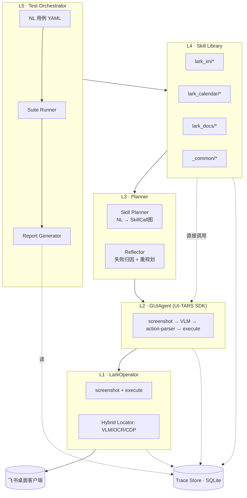

# CUA-Lark 系统规范（Spec v1.0）

> 飞书 AI 校园挑战赛 · Computer-Use Agent for Lark
> 状态：**FINAL**。所有架构决策已锁定，无替代方案。

---

## FOR AGENTS · 阅读与使用约定

本文件由 Agent 协同消费。请按以下角色对号入座：

* **Planning Agent（规划角色）**：通读全文 → 按指定里程碑生成可交付的实施计划。
* **Implementing Agent（实现角色）**：依据规划 Agent 的 plan 编码 → 任何类型签名/接口/约束以本规范为准。
* **Reviewing Agent（评审角色）**：对照本规范的"验收标准"逐条核验。

**硬约束：**

1. 本文件中"决策"章节为终态，不接受任何 agent 自行替换。如遇规范确实未覆盖的细节，**列入"开放问题"由用户裁决**，不得静默假设。
2. 所有"代码片段"为**接口与模式示意**，不是字面实现。Implementing Agent 须按所在项目代码风格落地。
3. 所有数字阈值（如 `maxLoopCount=25`、`P50<30s`）为目标值，非编译时常量；都应可配置。
4. 文档中出现 "DO" / "DO NOT" 的条目为强制规范，不可违反。

---

## 1. 项目目标

构建 **CUA-Lark**：一个基于视觉理解的飞书桌面客户端自动化测试 Agent。

**最小成功定义（v1）：**

* 接受自然语言测试用例 → 自主操控飞书桌面客户端 → 输出含通过率、耗时、Token 成本的可视化报告。
* 至少覆盖飞书 IM、Calendar、Docs 三个子产品，每个 ≥ 3 条端到端用例。
* 同一用例运行 5 次，通过率方差 ≤ 10%。

---

## 2. 硬约束（HARD CONSTRAINTS）

| # | 约束 | 说明 |
|---|---|---|
| C1 | TypeScript 5.7+ / Node 20+ | 与 UI-TARS 一致 |
| C2 | 直接基于 `@ui-tars/sdk` 与 `@ui-tars/operator-nut-js` | DO NOT 重新实现 GUIAgent 主循环、action-parser、坐标变换 |
| C3 | 所有模型调用走 OpenAI-compatible Chat Completions 协议 | 统一封装 `ModelClient`，DO NOT 直接 import 任何具体厂商 SDK |
| C4 | VLM/LLM 选型可通过环境变量热切换 | 同一份代码必须能在 Doubao 系列、Qwen-VL、GPT-4o、Claude 之间一键切换 |
| C5 | Agent **禁止**自动登录飞书 | 任何账密/扫码/SSO 流程必须由真人完成；检测到未登录直接抛错 |
| C6 | 所有屏幕坐标全程使用 UI-TARS 的 `parseBoxToScreenCoords` | DO NOT 手算 DPI 缩放 |
| C7 | 业务级动作必须沉淀为 Skill | DO NOT 把"发 IM 消息"这类动作直接写在测试用例脚本里 |
| C8 | Trace 必须持久化到本地，不依赖外部服务 | 离线可重放、可生成报告 |

---

## 3. 整体架构

### 3.1 五层架构



### 3.2 单条用例数据流（Reference Flow）

```
1. CLI 加载 testcase YAML
2. SkillPlanner.plan(instruction) → SkillCall[]
3. 对每个 SkillCall：
   a. SkillRunner 取出 skill 实例
   b. 检查 preconditions
   c. 调用 skill.execute（procedural / agent_driven / recorded）
   d. 调用 skill.verify（VLM + OCR 复合验证）
   e. 失败 → fallback skill → 仍失败 → Reflector → 重规划
   f. 全程写入 TraceStore
4. ReportGenerator 从 TraceStore 生成静态 HTML
```

### 3.3 模块职责矩阵

| 模块 | 输入 | 输出 | DO NOT |
|---|---|---|---|
| LarkOperator | parsedPrediction | GUI 事件 + 截图 | 决定点哪里 |
| GUIAgent (UI-TARS) | NL 子目标 + Operator | 多步执行直至 finished | 用例编排 |
| Skill | typed params | 业务级 result + verify 结果 | 写测试报告 |
| SkillPlanner | NL 用例 | SkillCall[] | 直接执行 |
| Verifier | VerifySpec + 当前截图 | { passed, reason, evidence } | 决定重试 |
| Reflector | 失败 trace | error_kind + 建议（重试/跳过/重规划） | 直接执行 |
| TraceStore | 事件流 | SQLite 行 | 截图 base64 入库（用文件路径） |
| Reporter | TraceStore | 静态 HTML 报告 | 实时干预 |

---

## 4. 模块规格（Module Specifications）

### 4.1 LarkOperator

**契约：**

* `extends @ui-tars/sdk` 的 `Operator` 抽象类。
* 实现 `screenshot(): Promise<ScreenshotOutput>` 与 `execute(params: ExecuteParams): Promise<ExecuteOutput>`。
* `static MANUAL.ACTION_SPACES` 必须与 `execute` switch 分支一一对应。
* 额外暴露给 Skill 层使用的非 GUIAgent 路径：
  * `findByText(text: string): Promise<Box | null>` → 走 OCR
  * `findByA11y(role, name): Promise<Box | null>` → 走 CDP（M5 才实现，M1-M4 返回 null）
  * `waitForVisible(text, opts): Promise<void>` → 轮询 OCR

**支持的 action_type（首期）：**

```
click | double_click | right_click
drag (start_box → end_box)
type(content)            // \n 表示提交
hotkey(key)              // ctrl+s, cmd+f 等
scroll(start_box, direction)
wait                     // sleep 5s
finished | call_user
```

**DO NOT：**

* DO NOT 在 LarkOperator 内做业务判断（"如果是 IM 面板就……"）。
* DO NOT 自实现键映射；macOS 的 cmd/ctrl 转换委托给 NutJSOperator。

### 4.2 ModelClient（统一模型客户端）

**契约：**

```typescript
interface ModelClient {
  // 多模态对话（用于 VLM 与 GUIAgent 主循环）
  chatVision(req: VisionRequest): Promise<VisionResponse>;
  // 纯文本对话（用于 SkillPlanner、Reflector）
  chatText(req: TextRequest): Promise<TextResponse>;
}
```

**实现要求：**

* 内部使用 OpenAI 官方 SDK（`openai` npm 包）作为 HTTP 客户端。
* 通过环境变量配置端点：
  ```
  CUA_VLM_BASE_URL    e.g. https://ark.cn-beijing.volces.com/api/v3
  CUA_VLM_API_KEY
  CUA_VLM_MODEL       e.g. doubao-1.5-vision-pro / qwen-vl-max / gpt-4o / ui-tars-72b
  CUA_LLM_BASE_URL    可与 VLM 不同
  CUA_LLM_API_KEY
  CUA_LLM_MODEL       e.g. doubao-1.5-pro / deepseek-chat / gpt-4o
  ```
* DO NOT 在业务代码中 import `openai` 包；只在 `ModelClient` 实现内 import。
* DO NOT 把模型名硬编码在 Skill 或 Planner 里。
* 必须支持配置层覆盖（per-skill 或 per-test 指定不同模型，便于 A/B）。

**接入 UI-TARS SDK：**

`@ui-tars/sdk` 的 `model` 字段本身就接受 `{baseURL, apiKey, model}`，直接把 ModelClient 的 VLM 配置喂进去即可。DO NOT 包一层适配。

### 4.3 Skill 抽象

**Skill 类型定义：**

```typescript
type SkillKind = 'procedural' | 'agent_driven' | 'recorded';

interface Skill<P = unknown, R = unknown> {
  name: string;                 // 全局唯一，形如 'lark_im.send_message'
  kind: SkillKind;
  description: string;          // 一句话，喂给 Planner
  manual: string;               // 完整 SKILL.md 正文（含使用与不使用条件）
  params: ZodSchema<P>;
  preconditions?: ((ctx: Context) => Promise<boolean>)[];
  execute: (ctx: Context, params: P) => Promise<R>;
  verify?: (ctx: Context, params: P, result: R) => Promise<VerifyResult>;
  fallback?: string;            // skill name；通常指向同名 agent_driven 版本
  uses?: string[];              // 子 skill 列表（用于复合 skill）
}

interface VerifyResult {
  passed: boolean;
  reason: string;
  evidence?: { screenshot?: string; ocrText?: string };
}
```

**三种实现风格的强制规则：**

| Kind | 何时使用 | DO | DO NOT |
|---|---|---|---|
| `procedural` | 高频核心路径（IM 发消息、日历建会等 ≥10 次/天的动作） | 用 `findByText` / `findByA11y` 直接定位；硬编码步骤序列 | 调用 `agent.run()` |
| `agent_driven` | 长尾/边缘场景；procedural 的 fallback | 给 GUIAgent 一段明确目标 + 完成判据 | 假设 GUIAgent 一定成功，必须配 verify |
| `recorded` | 临时回归用例；难以语言描述的精细操作 | 加载 `[{action, screenshot}]` 序列，按截图相似度回放 | 用于核心路径（脆弱） |

**Fallback 自愈机制（强制）：**

```
SkillRunner.run(skill, params):
  try execute → verify
  if 失败:
    record failure to trace
    if skill.fallback:
      logger.warn(...)
      return run(registry.get(skill.fallback), params)
    else:
      throw
```

**Skill 复合调用：**

* 高层 Skill 可在 `execute` 内通过 `ctx.runSkill(name, params)` 调用其它 Skill。
* `uses` 字段必须如实声明所有调用，供 Planner 决定是把高层 skill 当 leaf 还是当 composite 使用。

### 4.4 Skill 文件布局

每个 skill **一个目录**：

```
skills/
└── <domain>/                   # 例：lark_im
    └── <action>/               # 例：send_message
        ├── SKILL.md            # 给 Planner 的"使用说明书"
        ├── procedural.ts       # 默认实现（如有）
        ├── agent_driven.ts     # fallback 实现
        ├── verify.ts           # 共享验证逻辑
        ├── fixtures/           # recorded 素材或参考截图
        └── examples.test.ts    # vitest
```

**SKILL.md 规范（前言用 frontmatter）：**

```markdown
---
name: lark_im.send_message
kind: procedural
fallback: lark_im.send_message_agent
preconditions:
  - lark.is_open
  - lark.is_logged_in
  - lark.im_panel_active
params_schema: ./params.schema.json
---

# 在 IM 当前会话发送一条消息

## 何时使用
- 已选中某个会话
- 发送纯文本、表情、@提及

## 何时不要使用
- 还没选中会话 → 先调 lark_im.search_contact
- 发图片/文件 → 用 lark_im.send_attachment

## 副作用
- 输入框被清空
- 消息列表底部追加一条
```

Planner 启动时扫描 `skills/**/SKILL.md`，把 frontmatter + 使用条件部分注入到 Planner system prompt。

### 4.5 SkillPlanner

**契约：**

```typescript
interface SkillPlanner {
  plan(instruction: string, ctx: Context): Promise<SkillCall[]>;
  replan(failed: SkillCall, error: SkillError, ctx: Context): Promise<SkillCall[]>;
}

interface SkillCall {
  skill: string;
  params: Record<string, unknown>;          // 必须能通过 skill.params zod 校验
  retryPolicy?: { times: number; backoffMs: number };
}
```

**实现规则：**

* 使用 `ModelClient.chatText`（无需视觉）。
* 必须强制 `responseFormat: 'json_object'`，并对输出做 zod 校验。
* zod 校验失败 → 自动重试 1 次（在 prompt 里附加 schema 错误信息）→ 仍失败抛 `PlanFormatError`。
* DO NOT 在 plan 中输出自然语言步骤；只输出结构化 SkillCall。

### 4.6 Verifier

**VerifySpec 类型：**

```typescript
type VerifySpec =
  | { kind: 'vlm';   prompt: string }
  | { kind: 'ocr';   contains: string | RegExp; in?: Box }
  | { kind: 'pixel'; refImage: string; threshold: number }
  | { kind: 'a11y';  role: string; name: string }      // M5 启用
  | { kind: 'all';   of: VerifySpec[] }
  | { kind: 'any';   of: VerifySpec[] };
```

**默认验证策略：**

* 任何 Skill 的 `verify` 默认采用 `{ kind: 'all', of: [vlm, ocr] }` 模式（任一失败则判定失败）。
* 失败时**只重试一次截图**（飞书有约 200ms 动画延迟），仍失败才标记验证失败。
* OCR 用 fuzzy match（Levenshtein ≤ 1）容忍 1 字识别错误。

### 4.7 TraceStore

**Schema（SQLite，使用 Drizzle ORM）：**

```sql
CREATE TABLE traces (
  id          TEXT PRIMARY KEY,            -- ULID
  test_run_id TEXT NOT NULL,
  parent_id   TEXT,                        -- 父节点；test→skill→step→action 树
  kind        TEXT NOT NULL,               -- test|skill|step|action|verify|reflect
  name        TEXT NOT NULL,
  status      TEXT NOT NULL,               -- pending|running|passed|failed|skipped
  started_at  INTEGER NOT NULL,            -- ms epoch
  ended_at    INTEGER,
  payload     JSON NOT NULL,               -- params/result/error/prediction/screenshot_path
  cost_tokens INTEGER DEFAULT 0,
  cost_ms     INTEGER DEFAULT 0
);

CREATE INDEX idx_traces_run ON traces(test_run_id);
CREATE INDEX idx_traces_parent ON traces(parent_id);
```

**存储约定：**

* 截图 **不入库**，存 `traces/{run_id}/screenshots/{trace_id}.png`，payload 里只存相对路径。
* SQLite 必须开 WAL：`?journal_mode=WAL`。
* 每条 trace 由对应模块在自己的入口/出口点写入；DO NOT 跨模块写他模块的 trace。

### 4.8 Reporter

**输出形态：**

* 静态 React + Vite 站点，构建产物为 `report/dist/index.html` + 资源。
* 离线打开 `index.html` 即可查看（不依赖任何后端）。
* 数据来源：构建时把 SQLite 查询结果导出为 `report/data.json`，前端只读这个文件。

**必含视图：**

| 视图 | 内容 |
|---|---|
| Overview | 通过率、总耗时、Token 成本、failure_kind 饼图 |
| Suite | 用例列表 + 状态徽章 + 耗时 |
| Test Detail | 步骤甘特图 + 每步前后截图对比 + 思维链折叠 |
| Failure Analysis | 按 error_kind 分组 + 典型失败截图 |

---

## 5. 项目结构

```
cua-lark/
├── packages/
│   ├── core/                       # 与业务无关的内核
│   │   └── src/
│   │       ├── operator/LarkOperator.ts
│   │       ├── operator/locators/{OcrLocator,CdpLocator}.ts
│   │       ├── model/ModelClient.ts
│   │       ├── planner/SkillPlanner.ts
│   │       ├── runner/SkillRunner.ts
│   │       ├── verifier/{VlmVerifier,OcrVerifier,CompositeVerifier}.ts
│   │       ├── reflector/Reflector.ts
│   │       ├── trace/{TraceStore,TraceWriter}.ts
│   │       └── types.ts
│   ├── skills/                     # 所有 skill
│   │   ├── lark_im/
│   │   ├── lark_calendar/
│   │   ├── lark_docs/
│   │   └── _common/
│   ├── ocr-bridge/                 # Python 子进程
│   │   ├── server.py               # FastAPI + PaddleOCR PP-OCRv4
│   │   └── client.ts
│   ├── reporter/                   # React + Vite 静态报告
│   └── cli/
│       └── src/index.ts            # cua-lark run testcases/*.yaml
├── testcases/                      # NL 用例
├── recordings/                     # recorded skill 素材
├── traces/                         # 运行产物（gitignore）
├── configs/
│   ├── models.yaml
│   └── lark.yaml                   # 飞书安装路径、CDP 端口
├── pnpm-workspace.yaml
├── turbo.json
└── README.md
```

---

## 6. 里程碑（Milestones）

每个里程碑给出：**目标** / **交付物** / **验收标准** / **常见坑**。

### M1 · 单步操作闭环

**目标：** 跑通 `截图 → ModelClient → action-parser → 单步执行` 链路。

**交付物：**
1. pnpm workspace + turbo 初始化，`packages/core` 与 `packages/cli` 框架。
2. `ModelClient` 实现，支持 env 配置切换。
3. `LarkOperator` 最小版本（screenshot + 5 个 action）。
4. CLI 命令 `cua-lark exec "<NL 指令>"` 可调用 `GUIAgent.run()`。

**验收：** 飞书已打开状态下，给出"在 IM 列表里点击第一个会话"，能正确执行。

**常见坑：**
* macOS 必须授予 Terminal 「辅助功能」+「屏幕录制」权限。
* 高分屏：检查 ScreenshotOutput.scaleFactor，错值 = 全屏点偏。
* `MANUAL.ACTION_SPACES` 必须按 UI-TARS 既定文法书写，否则模型不会输出对应 action。

### M2 · 流程串联 + Skill 抽象

**目标：** 在 IM 子产品上完成 3 条端到端用例，引入 Skill 抽象。

**交付物：**
1. `Skill` 接口、`SkillRegistry`、`SkillRunner`（含 fallback 机制）。
2. `_common/ensure_app_open`、`_common/dismiss_popup` 两个通用 skill。
3. IM 三个 **agent_driven** skill：`search_contact` / `send_message` / `verify_message_sent`。
4. 最简 `OcrVerifier`（依赖 `ocr-bridge` 已联通）。
5. CLI `cua-lark run testcases/*.yaml`。

**验收：** 命令行跑 IM 3 条用例全绿。

**常见坑：**
* agent_driven skill 的 prompt 必须显式给"完成条件"，否则 UI-TARS 容易 `finished()` 早退。
* OCR 截图先按 region 裁剪再识别（消息区固定在右 60%），精度提升 ≥ 30%。

### M3 · 多产品覆盖 + procedural 沉淀

**目标：** 扩展到 Calendar 和 Docs，每个 ≥ 2 用例；把 M2 跑稳的 agent_driven 改为 procedural。

**交付物：**
1. `ocr-bridge` Python 子进程接入（PaddleOCR PP-OCRv4 + RapidOCR 兜底）。
2. `lark_im.send_message` 的 procedural 实现 + 保留 agent_driven 作 fallback。
3. Calendar skill 集：`open_calendar` / `create_event` / `set_event_time`。
4. Docs skill 集：`create_doc` / `set_doc_title` / `insert_text`。
5. `SkillPlanner` 实现（NL → SkillCall[]，强制 JSON + zod 校验）。
6. ≥ 6 条新用例 YAML。

**验收：**
* IM 3 + Cal 3 + Docs 3 = 9 条用例全绿。
* 同一 IM 用例 procedural vs agent_driven 跑一次，**procedural 至少快 5×**。

**常见坑：**
* SkillPlanner 输出 JSON 偏离 schema → 必须重试 1 次 + zod 校验。
* Calendar 弹窗（"是否开启提醒"）要纳入 `_common/dismiss_popup`。

### M4 · 评测体系

**目标：** Trace 持久化 + 静态报告 + 评测脚本。

**交付物：**
1. `TraceStore`（SQLite + Drizzle），Skill/Step/Action/Verify 全程入库。
2. `reporter` 包：React + Vite 静态站点，含 Overview / Suite / Detail / Failure 四视图。
3. CI 集成：`pnpm test:e2e` 跑全量 + 报告 artifact。
4. 评测脚本：固定 9 用例 × 5 轮，输出 P50/P95/通过率/平均步数 markdown 表。

**验收：**
* 任意一次运行后 `report/dist/index.html` 可看完整报告。
* 评测脚本输出可直接贴答辩 PPT。

**常见坑：**
* SQLite 在 macOS Spotlight 索引下偶尔锁，必须 WAL。
* 截图 base64 不入库（太占空间），存文件路径。

### M5 · 进阶能力

**目标：** 异常弹窗自愈 + 跨产品联动 + 混合定位（CDP）。

**交付物：**
1. **异常弹窗自愈**：每次 action 前过一次"弹窗检测"（独立 VLM 调用），命中先关弹窗再做主任务。
2. **跨产品联动**：1 条 `cross/im_to_calendar.yaml` 用例（IM 收到日历邀请 → 跳转 Calendar 接受 → 返回 IM 验证状态）。
3. **CdpLocator**：飞书启动加 `--remote-debugging-port=9222`，实现按 ARIA 名定位；接入 `LarkOperator.findByA11y`。
4. **三段定位降级**：VLM → OCR → CDP，在所有 procedural skill 中默认启用。

**验收：**
* 关闭飞书的"是否更新"弹窗用例自动通过。
* 跨产品用例端到端绿。
* 同一 IM 用例 CDP 定位 vs 纯 OCR 定位，CDP 快 ≥ 30%。

**常见坑：**
* Electron CDP 端口需要修改飞书启动参数；macOS 沙箱可能限制端口绑定，需文档化解决方案。
* 弹窗检测器频繁调用 VLM 会拉高 token 成本，需要节流（如每 N 步检查一次或仅在特定事件后检查）。

---

## 7. 决策记录（DECIDED · 不可推翻）

| # | 决策 |
|---|---|
| D1 | TypeScript + Node 20 + `@ui-tars/sdk` |
| D2 | Skill 三种实现并存：procedural（默认）+ agent_driven（fallback）+ recorded（临时） |
| D3 | M1–M4 纯视觉（VLM + OCR），M5 才接 CDP |
| D4 | 模型走 OpenAI-compatible HTTP，VLM 与 LLM 分别可配 |
| D5 | OCR 走 Python 子进程（PaddleOCR）+ RapidOCR 兜底 |
| D6 | Trace 用 SQLite + Drizzle，截图存文件 |
| D7 | 报告做静态 React 站点，无后端 |
| D8 | Agent 禁止自动登录飞书 |
| D9 | 用例描述用 YAML，Planner 输出用 JSON |
| D10 | 包管理 pnpm + workspace + turbo |

---

## 8. 风险登记

| 风险 | 概率 | 影响 | 应对 |
|---|---|---|---|
| 飞书 UI 改版 | 中 | 高 | procedural fail → 自动降级 agent_driven，零代码修复 |
| VLM API 限流 | 中 | 中 | 配置层支持多 baseURL 轮询；procedural 不走 VLM 不受影响 |
| OCR 中文误识 | 中 | 中 | fuzzy match（Levenshtein ≤ 1）+ VLM 双重验证 |
| 弹窗类型未覆盖 | 高 | 中 | `_common/dismiss_popup` 用 agent_driven，每次截图直接问 VLM |
| macOS 权限 | 高 | 低 | README 写流程；启动时检测，无权限直接 fail-fast |
| Token 成本失控 | 中 | 中 | 每用例硬性 maxLoopCount；procedural skill 不消耗 token；Reporter 暴露成本面板 |
| Electron CDP 兼容 | 低 | 中 | 仅在 M5 启用，前 4 阶段不依赖 |

---

## 9. 评测指标

| 指标 | 定义 | 目标 |
|---|---|---|
| 用例通过率 | passed / total | ≥ 80% |
| 首次通过率 | first_try_passed / total（不含 fallback 救活） | ≥ 60% |
| 自愈率 | fallback_救活数 / procedural_失败数 | ≥ 50% |
| 平均步数 | 用例平均 action 数 | 越低越好 |
| 用例耗时 | wall-time P50 / P95 | P50 < 30s |
| Token 成本 | 平均 input + output token | 越低越好 |
| 失败归因覆盖 | error_kind ≠ unknown 的占比 | ≥ 90% |

`error_kind` 取值（强制枚举，便于聚合）：
`locator_failed | verify_failed | model_timeout | popup_blocked | precondition_unmet | network | unknown`

---

## 附录 A · 核心类型（接口契约速查）

```typescript
// === 用例 ===
interface TestCase {
  id: string;
  title: string;
  tags: string[];
  instruction: string;            // NL
  expectations: string[];         // NL，喂给最终 Verifier
  timeoutSeconds: number;
}

// === Planner 输出 ===
interface SkillCall {
  skill: string;
  params: Record<string, unknown>;
  retryPolicy?: { times: number; backoffMs: number };
}

// === 运行时上下文 ===
interface Context {
  operator: LarkOperator;
  agent: GUIAgent;                // 给 agent_driven skill 用
  registry: SkillRegistry;
  model: ModelClient;
  trace: TraceWriter;
  ocr: OcrClient;
  logger: Logger;
  config: Config;
  snapshot(): Snapshot;           // 当前飞书状态、最后一次截图
  runSkill(name: string, params: unknown): Promise<unknown>;  // 复合 skill 用
}

// === 错误分类 ===
type ErrorKind =
  | 'locator_failed' | 'verify_failed' | 'model_timeout'
  | 'popup_blocked'  | 'precondition_unmet'
  | 'network' | 'unknown';

class SkillError extends Error {
  kind: ErrorKind;
  evidence?: { screenshot?: string; ocrText?: string };
}
```

## 附录 B · Skill 模板模式

任何 Skill 文件遵循以下导出模式：

```typescript
// skills/<domain>/<action>/procedural.ts
import { defineSkill } from '@cua-lark/core';
import { z } from 'zod';

export default defineSkill({
  name: 'lark_im.send_message',
  kind: 'procedural',
  description: '...',
  manual: '...（即 SKILL.md 全文）',
  fallback: 'lark_im.send_message_agent',
  params: z.object({ /* ... */ }),
  preconditions: [ /* ... */ ],
  async execute(ctx, params) { /* ... */ return result; },
  async verify(ctx, params, result) {
    return ctx.verifier.run({
      kind: 'all',
      of: [
        { kind: 'vlm', prompt: '...' },
        { kind: 'ocr', contains: params.text },
      ],
    });
  },
});
```

`agent_driven.ts` 的差异：

```typescript
async execute(ctx, params) {
  await ctx.agent.run(`<明确目标 + 完成判据>`, { maxLoopCount: 10 });
  return { /* 最小 result */ };
}
```

---

## 附录 C · 待 Implementing Agent 处理的开放槽位

以下条目本规范**故意不指定具体值**，由 Implementing Agent 在落地时按工程默认值填充，并在 PR 中标注：

* `maxLoopCount` 默认值（建议 25，per-skill 可覆盖）
* OCR 服务进程的端口与启动方式（FastAPI on 0.0.0.0:7010 是合理默认）
* 截图归档保留策略（建议保留最近 N 次运行，或按大小回收）
* turbo 缓存 key 设计
* TypeScript 严格模式开关组合（建议 strict + noUncheckedIndexedAccess）

---

**文档结束。如发现规范缺失或前后矛盾，列入 `OPEN-QUESTIONS.md` 由用户裁决，DO NOT 静默假设。**
